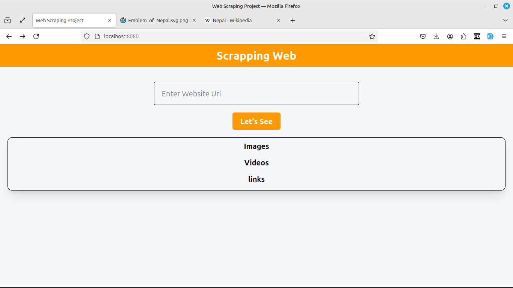
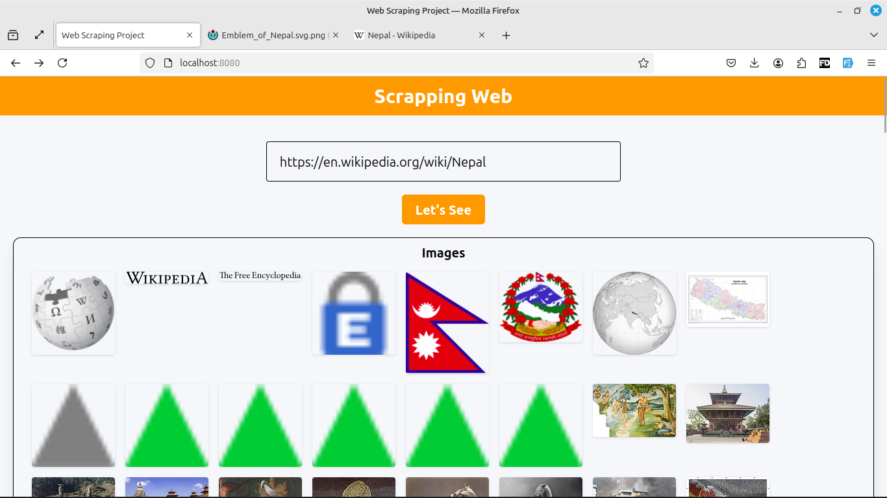

# Web Scraping in Springboot

## Project Features
1. Scarp website using Jsoup on Springbooot 4, Java 17
2. Beautiful layout with tailwind css
3. Scraps Images, Video and Links


```
we can access the output on localhost:8080 after running the project.

``` 

## Screenshots

### 🖼️ Screen 1


### 🖼️ Screen 2


